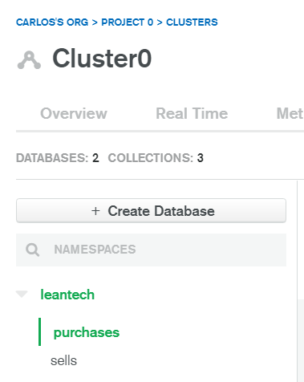
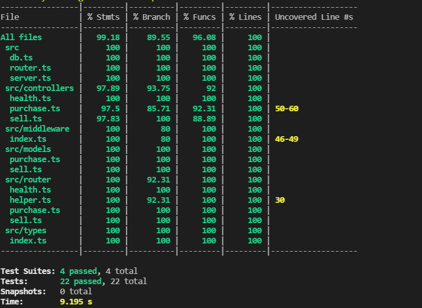
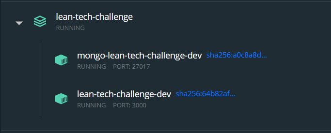

# lean-tech-challenge
Technical challenge made in Nodejs

## Prerequisites

- Docker (brew cask install docker on mac)
- Mongo (The docker-compose uses Mongo:latest)
- Node 12+

## Environment Variables
 - Environment variables for local development are found in env.development
    ```
    PORT=3000
    MONGO_URI=mongodb://127.0.0.1:27017/leantech
    ```
    
## Development
- There are two main ways of running this project
1. Using docker
   - Having docker installed, simply run `./scripts/dev.sh`. This will run the project with a mongodb container and watch on file changes on any `.ts` file.
2. Manually using node and mongodb 
   - You will need to have a mongodb instance running on default port `27017`
   - Then, you need to install the dependencies using `yarn` or `npm i`
   - After that, you will be able to run the project using `yarn dev`

## Production
   - To deploy to production, the machine needs to have a new file called `.env.production` with the same env variables, but with a MONGO_URI variable pointing towards a production ready URI (mongo atlas is suggested)
   - Having docker installed, run `./scripts/prod.sh`

## Features

   ### MongoDB Database to store all the data

   - Configured a production-ready database with Mongo Atlas to be able to handle data persistency

   

### Unit testing
   
   - Implemented 22 unit tests and achieved over 80% code coverage for all files.

   

### Docker & Docker Compose
   
   - Using docker and docker compose for easy setup of the development and production environments.

   

### Eslint, prettier and husky

   - Using eslint and prettier for linting and unified formatting. Code also formats itself on save automatically. Also using husky for pre-commit hooks so code can be linted before being pushed to the repo.

### MVC Architecture with Typescript & KOA

   - The architecture implemented in this exercise is an MVC architecture, where business logic is separated inside the `/controller/` folder, models are defined inside the `/models/` folder and the 'view' is represented by the routes defined in the `router` folder. 

   - Using typescript for type assertion and better coding experience. Also using KOA as the Nodejs API Rest framework.